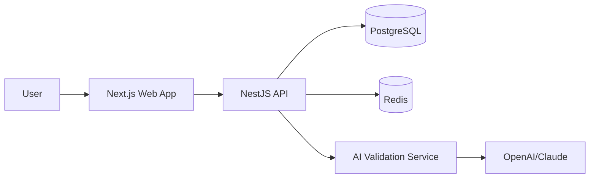

# System Architecture

## High-Level

## Modules

- **Auth Module**: JWT access/refresh, secure cookies, device/session controls.
- **Course Module**: Sections, lessons, progress locks, prerequisites.
- **Assessment Module**: Written-answer mini-exams and finals.
- **AI Module**: question generation + semantic scoring with rubric.
- **Anti-Cheat Module**: tab-switch events, paste heuristics, timing anomalies.
- **Analytics Module**: XP, streaks, heatmap, progress graph.

## Attempt Lifecycle

1. User clicks `Next Lesson`.
2. API checks if mandatory test is completed.
3. If not complete, server creates a new `attempt` and asks AI for 3 unique questions.
4. User submits written answers.
5. AI scoring returns score + qualitative feedback.
6. If score >= 70, unlock next lesson.
7. If score < 70, create 30-minute cooldown and block retry until expiration.

## Final Exam Lifecycle

- Generated as 20 scenario-heavy written prompts.
- 2-hour server-side timer.
- Pass threshold 85%.
- Anti-cheat signals persisted and surfaced to instructors/auditors.
